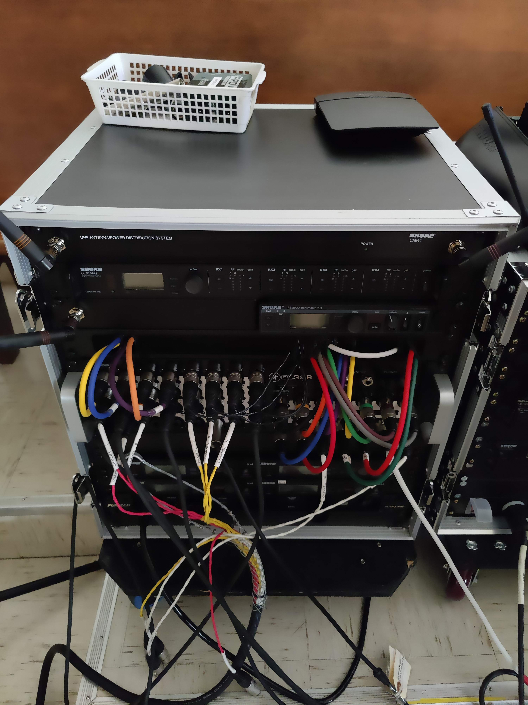

Controlling Audio
#################

Powering Up / Powering Down Equipment
*************************************

.. _powering-up-rack:

Powering Up Audio Equipment
===========================

#. Turn the rig on by flipping the master power switch.  When it is off, it is flipped to the left.  When it is on, it is flipped to the right.

    .. figure:: ../images/Rig-Power-Switch.jpg

    The rig power switch, found on the left-rack on the bottom.  In this image, it is on because it is flipped to the right.

    |

#. Turning the rig on will turn on the right speaker, but the left one must be flipped on manually.

    .. figure:: ../images/Speaker-Left.jpg

    The left speaker on its post

    |

    .. figure:: ../images/Speaker-Rear.jpg

    The power switch is found on the lower right-hand side at the back

    |

    .. figure:: ../images/Speaker-Powered.jpg

    When powered on, the speaker will have a blue light illuminated on the front.

    |

#. Connect to Master Fader and ensure you can see the right.

   * Connect to "TheRig" WiFi with an Android, iPad or Mac device
   * Open Master Fader and select "The Rig" from the device list.

Powering Down Audio Equipment
=============================

#. You do not need to do anything special to save any settings or shutdown safely.  When all live-streaming is done:

   * Turn the left speaker off.
   * Flip the power switch on the rig back to the left to turn off the right speaker and all other audio equipment.

Controlling the Equipment
-------------------------

The Rack
========

Behind the organ in the sanctuary, there are two equipment racks with a variety of components in them.  You are not expected to change any of this configuration or worry about 
any settings in particular.  If special accommodations are required for a particular performer or ensemble, an audio enginner 
will be available to assist.

The Left Half
=============

The left half of the rig has the following components in it to serve the following functions

    The left half of the sanctuary equipment rack

|

In order:

#. UHF antenna distributor - amplifies the signals from our microphones back to the rack for wireless transmission.
#. Shure ULXD4Q - wireless microphone receiver for the 3 pastor headsets and the spare headset microphone
#. Shure PSM900 - wireless in-ear monitor (IEM) transmitter for the Live Stream channel
#. Mackie DL32R - the heart and soul of EVERYTHING.  A 32-channel mixer with 14 outputs.  Everything audio goes through here.
#. Shure Wireless Receivers - (obsolete) previously used for microphones we aren't using right now.
#. Power Distributor - this is where the master power switch is for the PDU used for the whole rack 

Master Fader
============

Master Fader is an application provided by Mackie, the manufactured of the DL32R mixer we use for audio management. (:ref:`See: 'Master Fader 5' <app-master-fader-5>`)