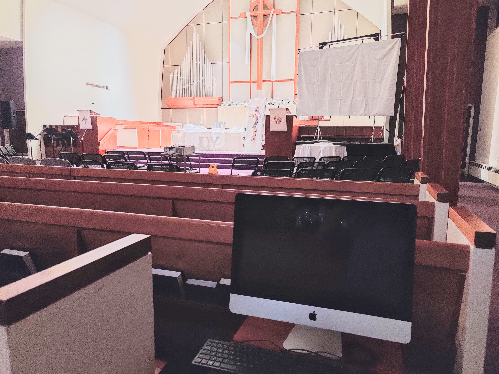

Managing FOH (Front of House) and Live Stream Audio
###################################################

Who This Is For
***************

If you have a responsibility to control the audio levels 
in the Sanctuary for...

* Worship
* Special Services (Funerals, Weddings)
* Special Presentations (Seminars, Speakers, etc.)

then this is the document for you.

What Do I Need?
***************

You may have needed your own device(s) in the past to manage
the audio system, or may have heard from volunteers that this 
was necessaary.

**You do not need your own device; the tools are provided for you.**

The Workstation
***************

The sound system can be managed from the iMac on the sanctuary 
floor, found on the right-hand side facing the chancel and just a 
few rows back.

Master Fader 5
==============

.. image:: ../../images/icons/master_fader_5.png
  :width: 100px
  :align: right

Master Fader is an application provided by Mackie, the 
manufacturer of the DL32R mixer (audio rig) we use for audio management.

Master Fader provides a virtual control surface for:

 * Adjusting audio levels
 * Muting / un-muting channels, for pastors, liturgists, vocalists, instruments, etc.

Where is it installed?
----------------------

You will see Master Fader on the desktop.  Double-click the 
icon to open it if it's not already open.

Using the Workstation
=====================

#. The login information for the iMac can be found on a sticky 
   note under the table it is sitting on.

#. When you are on the desktop, check the Wireless connection to see
   that you are connected to "TheRig".

   .. note::

       If you do NOT see "TheRig" listed under possible wireless connections
       that may be because the audio rack is not powered on.  Be sure the rack 
       is powered on before you attempt to use the iMac to manage audio.

#. Open "Master Fader" as described above.

#. With Master Fader running, click the icon shown below to 
   connect to the DL32R mixer with the application.

